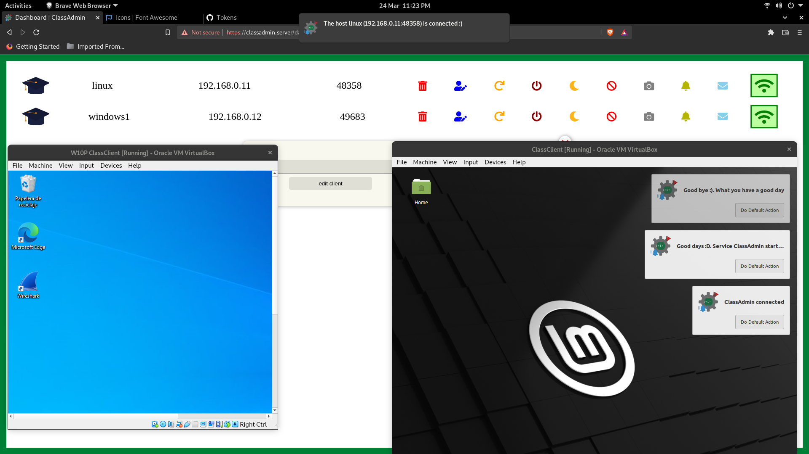

# LICENSE
This program is free software: you can redistribute it and/or modify it under the terms of the GNU General Public License as published by the Free Software Foundation, either version 3 of the License, or (at your option) any later version.
This program is distributed in the hope that it will be useful, but WITHOUT ANY WARRANTY; without even the implied warranty of MERCHANTABILITY or FITNESS FOR A PARTICULAR PURPOSE. See the GNU General Public License for more details.
You should have received a copy of the GNU General Public License along with this program. If not, see <https://www.gnu.org/licenses/>.

## You has keep this license and you nominates the software original author.

# INSTALLATION
At download the project execute the scripts INSTALL.sh (linux bash) or INSTALL.ps1 (Windows powershell). Though this is a reinstallation. The script in Linux changes the permmisions.
If you don't execute it, execute the comamnd in the current directory:
  chmod o+w /var/log 2> /dev/null && chown -R root:www-data . 2> /dev/null && chmod -R g+w . 2> /dev/null && chown www-data:ClassAdmin ./transfers/.screenshots/ 2> /dev/null && chmod -R 770 ./transfers/.screenshots 2> /dev/null

# NOTES
If don't show the notifications or popups in the machines, you edit in the function sendAlert (eventsClient.py) and function Notify (utils.py) the zenity commands adding '--display <display>'.
For you think you display environment you do: echo $DISPLAY and add the content in the zenity. Example:
    zenity --notification --title title --text message --display :10.0
# DOCUMENTATION
  You have the documentation in the repository in directory documentation/
  
# CONTACT
    cleanet
    cleannet29@gmail.com
